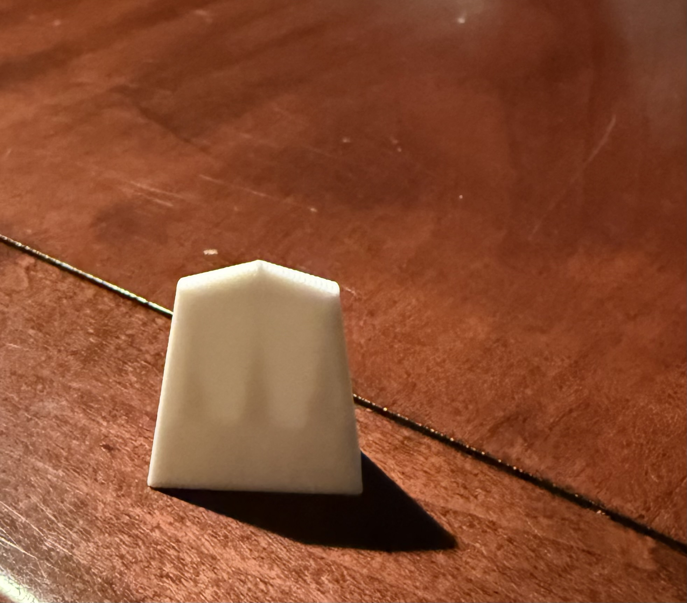
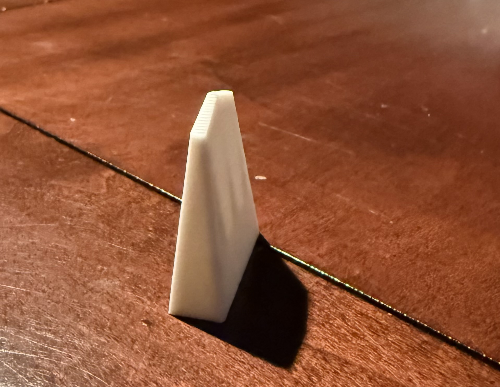

# Shogi 3D Print

This project is an effort to model Shogi (Japanese Chess) game pieces for 3D printing using OpenSCAD. The goal is to generate accurately shaped pieces with recessed Kanji characters for multi-material printing.

## Design Guides and Data Source

The design of these pieces is based on the following visual and dimensional guides:

*   **Front View:** `front-view.png`
*   **Side View:** `side-view.png`
*   **Measurements:** `measurements.csv`

The dimensional data and general design guidance were sourced from [Shogi.cloud/misure](https://www.shogi.cloud/misure/).

## Example Renders

Here are examples of the generated Shogi pieces:

### Front View Example

### Side View Example

## Usage

The `gemini.scad` file contains the OpenSCAD script. Please refer to the comments within `gemini.scad` for detailed instructions on how to use the Customizer to select and export individual pieces or specific parts (body, unpromoted text, promoted text) for multi-material 3D printing.
